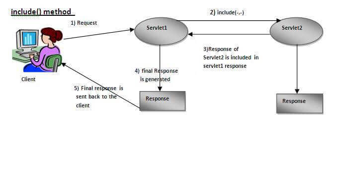

# Servlet collaboration

## Methods of RequestDispatcher interface

**public void forward\(ServletRequest request,ServletResponse response\)throws ServletException,java.io.IOException:**  Forwards a request from a servlet to another resource \(servlet, JSP file, or HTML file\) on the server.

**public void include\(ServletRequest request,ServletResponse response\)throws ServletException,java.io.IOException:** Includes the content of a resource \(servlet, JSP page, or HTML file\) in the response.

## SendRedirect in servlet

 The **sendRedirect\(\)** method of **HttpServletResponse** interface can be used to redirect response to another resource, it may be servlet, jsp or html file.

### Difference between forward\(\) and sendRedirect\(\) method

| forward\(\) method | sendRedirect\(\) method |
| :--- | :--- |
| The forward\(\) method works at server side. | The sendRedirect\(\) method works at client side. |
| It sends the same request and response objects to another servlet. | It always sends a new request. |
| It can work within the server only. | It can be used within and outside the server. |
| Example: request.getRequestDispacher\("servlet2"\).forward\(request,response\); | Example: response.sendRedirect\("servlet2"\); |

